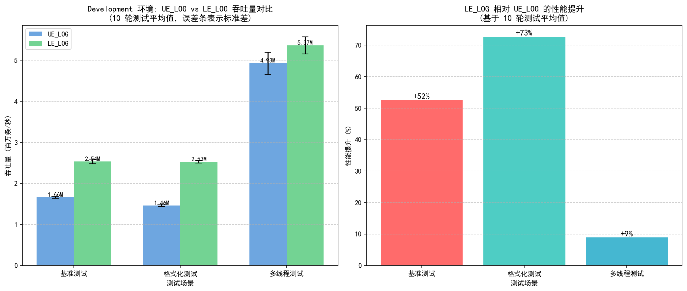

# LogEverything

LogEverything is an Unreal Engine plugin that embeds Tencent's high-performance [BqLog](https://github.com/Tencent/BqLog) runtime while preserving the familiar UE-style logging surface. It delivers hierarchical category management, asynchronous persistence, and zero-copy emission without forcing teams to abandon the ergonomics of `UE_LOG`.

> 中文说明请参阅 [README_CHN.md](README_CHN.md)。

## Core Capabilities
- **BqLog integration** – Logging macros forward directly to BqLog's template interface, so `{}` formatting, precision specifiers, and `UnrealEngine` string types (`FString`, `FName`, `FText`) function without manual conversion.
- **UE-style surface** – `DECLARE_LE_CATEGORY_EXTERN`, `DEFINE_LE_CATEGORY`, `LE_LOG`, and helper macros mirror Unreal’s native workflow, minimizing the learning curve.
- **Hierarchical category tree** – Categories such as `Game.Combat.Skill` are sourced from `Config/LogEverythingCategories.txt` and mirrored inside a lightweight `ULECategoryTree`, enabling inheritance-aware gating.
- **Runtime subsystem** – `ULELogSubsystem` (`UGameInstanceSubsystem`) tracks global verbosity, per-branch overrides, enable/disable flags, statistics, and debug exports, ensuring `C++` and `Blueprint` share a unified state.
- **Async-first defaults** – `FLELogSettings` ships with asynchronous flushing, sensible buffers, on-disk persistence, and baseline category configuration already enabled.
- **Bundled tooling** – `Windows`/`Linux`/`macOS` category generators and sync scripts keep the vendored **BqLog** sources aligned with upstream releases.

## Quick Start

### Installation

1. Copy `Plugins/LogEverything` to your project's `Plugins/` folder
2. Enable the plugin in Unreal Editor or add to your `.uproject` file
3. Build your project

That's it! LogEverything works out of the box with sensible defaults.

### Basic Usage

```cpp
// Step 1: Declare a log category (in header file)
DECLARE_LE_CATEGORY_EXTERN(LogCombat, Game.Combat);

// Step 2: Define the category (in source file)
DEFINE_LE_CATEGORY(LogCombat);

// Step 3: Start logging with modern {} formatting
LE_LOG(LogCombat, Info, TEXT("Player {} dealt {} damage"), PlayerName, DamageAmount);
```

### Why LogEverything?

| Feature | LE_LOG | UE_LOG |
|---------|--------|--------|
| Throughput | 2.54M logs/sec | 1.66M logs/sec |
| Format syntax | Modern `{}` placeholders | printf-style `%s %d` |
| Category hierarchy | `Game.Combat.Skill` | Flat categories |
| Runtime filtering | Per-category levels | Limited |
| Async persistence | Yes | Synchronous |

### Code Examples

**Simple Logging**
```cpp
LE_LOG(LogCombat, Info, TEXT("Combat started"));
LE_LOG(LogCombat, Warning, TEXT("Low ammo: {} rounds left"), AmmoCount);
LE_LOG(LogCombat, Error, TEXT("Failed to spawn projectile"));
```

**Conditional Logging**
```cpp
LE_CLOG(Health < 20.0f, LogCombat, Warning, TEXT("Critical health: {:.1f}"), Health);
LE_CHECK(IsValid(Target), LogCombat, Error, TEXT("Invalid target"));
```

**Convenience Macros**
```cpp
LE_LOG_INFO(LogCombat, TEXT("Match started with {} players"), PlayerCount);
LE_LOG_WARNING(LogCombat, TEXT("Server latency high: {}ms"), Latency);
LE_LOG_ERROR(LogCombat, TEXT("Connection lost"));
```

**Runtime Configuration**
```cpp
// Adjust log levels at runtime
LE_SET_CATEGORY_LEVEL(LogCombat, Warning);  // Only warnings and above
LE_SET_GLOBAL_LEVEL(Info);                  // Set global threshold
LE_DISABLE_CATEGORY(LogCombat);             // Temporarily disable
```

### Output Format

```
UTC+08 2025-09-27 10:51:36.942[tid-177304 GameThread] [I] [Game.Combat] Player John dealt 150 damage
UTC+08 2025-09-27 10:51:36.943[tid-177304 GameThread] [W] [Game.Combat] Low ammo: 5 rounds left
```

### Advanced Configuration (Optional)

For custom category hierarchies, edit `Config/LogEverythingCategories.txt`:

```text
Game
Game.Combat
Game.Combat.Damage
Game.Combat.Skill
Game.AI
Game.AI.Pathfinding
```

Then run `Tools/BqLogTools/GenerateLogEverythingCategories.bat` to regenerate category code.

For per-category level overrides, edit `Config/LogEverythingCategoryConfig.json`:

```json
{
  "defaultLevel": "Info",
  "categories": [
    { "name": "Game", "children": [
      { "name": "Combat", "level": "Debug" },
      { "name": "AI", "level": "Warning" }
    ]}
  ]
}
```

## Runtime Category Management
`ULELogSubsystem` and the Blueprint-friendly `ULogEverythingUtils` expose the entire category tree:
- Set or query levels with `ULogEverythingUtils::SetLogCategoryLevel`, `GetEffectiveLogLevel`, and `ShouldLogCategory`.
- Enable or disable branches via `SetCategoryEnabled` / `IsCategoryEnabled`, with convenience helpers for `game`/`engine`/`editor` domains.
- Reload or rebuild definitions using `ReloadLogSettings`, `ReinitializeCategoryTree`, and `ExportTreeDebugString`.
- Inspect filtering decisions through the console variable `LogEverything.Debug.LogCategory`.

All logging macros pass through `ULogEverythingUtils::InternalLogImp`, so verbosity checks run **before** any formatting work is performed.

### Console Commands & Debugging
- `LE.Test.ConditionalLogging` – Exercises conditional macros (`LE_CLOG`, `LE_CHECK`, etc.) against a sample gameplay state.
- `LE.Test.DynamicLevelFilter` – Demonstrates live category level adjustments and the `LogEverything.Debug.LogCategory` `CVar` workflow.
- `LE.Debug.PrintCategoryTree` – Emits the full category hierarchy, effective levels, and enablement flags to the log for inspection
- `LE.Debug.QueryCategoryLevel <Category>` – Reports the effective level for a specific category path.

Toggle verbose filtering traces with the `LogEverything.Debug.LogCategory` console variable.

## Tooling & Maintenance
- **Category generators** -- `Tools/BqLogTools/` bundles prebuilt generators for `Windows`, `Linux`, and `macOS` plus convenience scripts (e.g. `GenerateLogEverythingCategories.bat`).
- **JSON config generator** -- `Tools/BqLogTools/GenerateCategoryConfigJson.py` auto-generates `Config/LogEverythingCategoryConfig.json` with merge support. See [JSON Config Reference](Plugins/LogEverything/Tools/BqLogTools/README_CategoryConfig.md) for the full schema.

## Repository Layout
```
Plugins/LogEverything/
├─ Config/                     # Category definitions consumed by the generator
├─ Content/                    # Optional Unreal assets
├─ Resources/                  # Plugin icon and metadata
├─ Source/
│  ├─ BQLog/                   # Vendored BqLog sources (Apache 2.0)
│  ├─ Generated/               # Generated category accessors
│  └─ LogEverything/
│     ├─ Bridge/               # BqLog bridge layer
│     ├─ Category/             # Category declarations and tree implementation
│     ├─ System/               # GameInstance subsystem & type definitions
│     ├─ Utils/                # Blueprint utilities & internal helpers
│     └─ Macros/               # UE-style logging macros
└─ Tools/                      # Generators and helper scripts
```

## Performance Benchmarks

> Tested on Intel Core i7-14700 (28 cores), 127.6GB RAM, Windows 11, Development build
> 10-round average with coefficient of variation < 2.2%

### LE_LOG vs UE_LOG Comparison

| Scenario | UE_LOG | LE_LOG (with filtering) | Improvement |
|----------|--------|------------------------|-------------|
| Baseline (1M logs) | 1.66M/s | 2.54M/s | **+52%** |
| Formatted logging | 1.46M/s | 2.53M/s | **+73%** |
| Multi-threaded (4T) | 4.93M/s | 5.37M/s | **+9%** |

**Note**: LE_LOG includes full category/level filtering on every call. UE_LOG does not have this capability.

### Filter Overhead

| Filter Type | Per-call Overhead |
|-------------|------------------|
| Level filtering | **122 ns** |
| Category disabled | **122 ns** |

Even at high frequency, filtered log calls consume only ~120 nanoseconds each.

### Why LE_LOG is Faster

1. **Lock-free ring buffer** - BqLog kernel minimizes thread contention
2. **Async persistence** - Logs buffer in memory, background thread flushes to disk
3. **Efficient formatting** - `{}` placeholders outperform printf-style
4. **Lightweight filtering** - Category checks add minimal overhead (~120ns)



For detailed methodology and full results, see [Performance Report](docs/benchmark/PERFORMANCE_REPORT.md).

## What's New in 1.0.0
- **ShowDebug Visualization** - Real-time HUD display of category tree via `ShowDebug LogEverything` console command
- **Performance Benchmarks** - LE_LOG is **52-73% faster** than UE_LOG while including full filtering
- **Automated Test Suite** - 19 tests (11 functional + 8 performance) ensure reliability
- **Dual Global Level** - Separated initialization and runtime levels for flexible control
- **Filter overhead** measured at ~122 nanoseconds per call
- Detailed release notes: [v1.0.0 Changelog (EN)](ChangeLogs/CHANGELOG_v1.0.0_EN.md)

## What's New in 0.9.0
- Replaced the `ULECategoryConfigNode` UObject tree with a human-readable **JSON configuration** (`Config/LogEverythingCategoryConfig.json`) for per-category level and enablement overrides.
- Added `Tools/BqLogTools/GenerateCategoryConfigJson.py` to auto-generate JSON from `LogEverythingCategories.txt` with **merge mode** that preserves existing settings on regeneration.
- Streamlined `ULELogConfigAsset` by removing all editor-only UObject tree callbacks; the DataAsset now references a JSON path alongside `FLEBqLogConfig`.
- Category tree is printed to the log on initialization when `LogEverything.Debug.LogCategory` is enabled.
- Detailed release notes: [v0.9.0 Changelog (EN)](ChangeLogs/CHANGELOG_v0.9.0_EN.md).

## What's New in 0.7.0
- Added `ULELogSubsystem` as the runtime governance layer for levels, enablement, propagation, and statistics.
- Introduced `ULECategoryTree` to mirror **BqLog** categories, enabling inheritance-aware checks, batch toggles, and debug exports.
- Centralized logging flows through `ULogEverythingUtils::InternalLogImp`, ensuring filters run before formatting while maintaining zero-copy emission into **BqLog**.
- Expanded `Blueprint`/`C++` helpers for runtime adjustments and added `LogEverything.Debug.LogCategory` for diagnostic traces.
- Detailed release notes: [v0.7.0 Changelog (EN)](ChangeLogs/CHANGELOG_v0.7.0_EN.md).

## Licensing
- `LogEverything`: `Apache License 2.0` (`LICENSE`).
- Embedded **BqLog**: `Apache License 2.0` (`Plugins/LogEverything/Source/BQLog/LICENSE.txt`).
- Distributors who decouple **BqLog** should continue providing it under the same terms.

## Support & Roadmap
- **Issues / feature requests** – Open a `GitHub` issue with reproduction steps or desired behaviour.
- **Pull requests** – Mention tested `UnrealEngine` versions/platforms and attach relevant logs for significant changes.
- **Upcoming roadmap** -- Environment-specific category and verbosity policies (`development`, `QA`, `shipping`, `dedicated server`) plus configurable settings assets; CI/CD performance regression tests.
- **Changelogs** – Review [v1.0.0 Changelog (EN)](ChangeLogs/CHANGELOG_v1.0.0_EN.md), [v0.9.0 Changelog (EN)](ChangeLogs/CHANGELOG_v0.9.0_EN.md), [v0.7.0 Changelog (EN)](ChangeLogs/CHANGELOG_v0.7.0_EN.md) and earlier files for version history.
