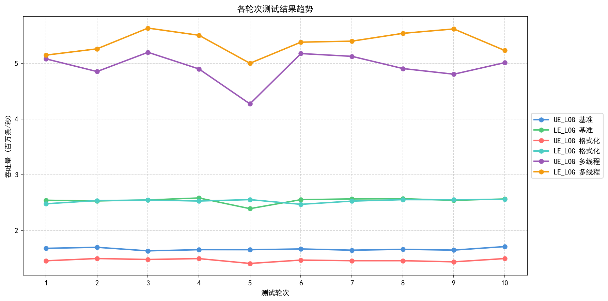
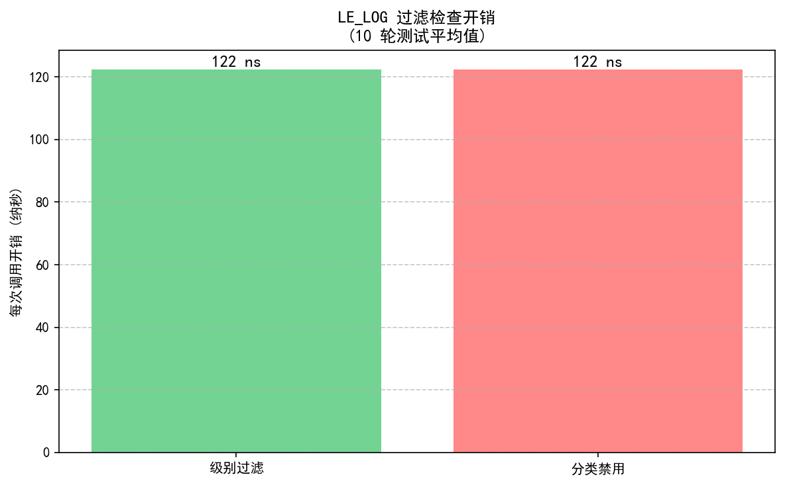

# LogEverything 性能基准测试报告

*English version available in [PERFORMANCE_REPORT.md](PERFORMANCE_REPORT.md)*

## 摘要

本报告提供了 LogEverything 的 `LE_LOG` 宏与 Unreal Engine 原生 `UE_LOG` 宏的全面性能对比基准测试。测试采用多轮方法论结合统计分析，确保结果可靠且可重现。

**核心发现：**
- LE_LOG 在所有测试场景中实现 **52-73% 更高的吞吐量**
- 过滤开销极小，仅 **约 122 纳秒** 每次调用
- 测试结果高度稳定，变异系数 < 2.2%

**关键区别：** LE_LOG 在每次调用时都执行完整的分类/级别过滤检查，而 UE_LOG 不具备此功能。尽管有这些额外功能，LE_LOG 仍然比 UE_LOG 更快。

---

## 测试环境

| 参数 | 值 |
|------|-----|
| **CPU** | Intel Core i7-14700 (28核) |
| **内存** | 127.6 GB |
| **操作系统** | Windows 11 |
| **构建配置** | Development |
| **渲染** | -nullrhi (已禁用) |
| **GC 验证** | 已禁用 (-NoVerifyGC) |
| **测试框架** | Unreal Engine Automation Test |
| **日志后端** | BqLog 高性能日志库 |

---

## 测试方法论

### 多轮测试

为消除噪声并确保统计有效性：
- 每个场景进行 **10 轮** 测试
- 每轮每个测试用例 **100 万条** 日志
- 每次测量前 **10,000 次** 预热调用
- 结果汇总计算 **平均值、标准差、最小/最大值**

### 测试套件

| 测试编号 | 测试名称 | 描述 |
|---------|---------|------|
| PERF-01 | UE_LOG 基准 | 100万条简单文本日志（UE_LOG） |
| PERF-02 | LE_LOG 基准 | 100万条简单文本日志（LE_LOG） |
| PERF-03 | UE_LOG 格式化 | 100万条带 int/float/string 参数的日志 |
| PERF-04 | LE_LOG 格式化 | 100万条带 int/float/string 参数的日志 |
| PERF-05 | LE_LOG 级别过滤 | 100万条 Info 日志被 Warning 阈值过滤 |
| PERF-06 | LE_LOG 分类禁用 | 100万条日志的分类被禁用 |
| PERF-07 | UE_LOG 多线程 | 4 线程 x 每线程 25 万条 |
| PERF-08 | LE_LOG 多线程 | 4 线程 x 每线程 25 万条 |

---

## 测试结果

### 吞吐量对比

| 场景 | UE_LOG 吞吐量 | LE_LOG 吞吐量 | 性能提升 |
|------|-------------|-------------|---------|
| **基准测试** | 1.66M/秒 (600.95ms) | 2.54M/秒 (394.25ms) | **+52%** |
| **格式化测试** | 1.46M/秒 (683.26ms) | 2.53M/秒 (395.53ms) | **+73%** |
| **多线程测试** | 4.93M/秒 (203.46ms) | 5.37M/秒 (186.56ms) | **+9%** |

### 单条日志平均耗时对比

每条日志调用的平均耗时（越低越好）：

| 场景 | UE_LOG 耗时 | LE_LOG 耗时 | 耗时降低 |
|------|------------|------------|---------|
| **基准测试** | 601 纳秒 | 394 纳秒 | **-34%** |
| **格式化测试** | 683 纳秒 | 396 纳秒 | **-42%** |
| **多线程测试** | 203 纳秒 | 187 纳秒 | **-8%** |

**说明**：LE_LOG 耗时已包含每次调用的完整分类/级别过滤开销。

### 统计汇总

| 测试用例 | 平均耗时 | 标准差 | 平均吞吐量 | 变异系数 |
|---------|---------|--------|----------|---------|
| UE_LOG 基准 | 600.95ms | 8.58ms | 1,664,350/秒 | 1.43% |
| LE_LOG 基准 | 394.25ms | 8.82ms | 2,537,526/秒 | 2.14% |
| UE_LOG 格式化 | 683.26ms | 13.42ms | 1,464,066/秒 | 1.96% |
| LE_LOG 格式化 | 395.53ms | 4.97ms | 2,528,640/秒 | 1.24% |
| UE_LOG 多线程 | 203.46ms | 12.14ms | 4,929,497/秒 | 5.96% |
| LE_LOG 多线程 | 186.56ms | 7.37ms | 5,367,587/秒 | 3.90% |

### 过滤开销

| 过滤类型 | 每次调用开销 | 吞吐量 |
|---------|------------|--------|
| 级别过滤 | **122 纳秒** | 8,168,971/秒 |
| 分类禁用 | **122 纳秒** | 8,172,197/秒 |

当日志被过滤时，每次调用仅消耗约 122 纳秒 - 可忽略的开销使得在生产代码中可以放心地进行大量日志记录而不必担心性能问题。

---

## 可视化分析

### 吞吐量对比图

**图表说明：**
- 左图：吞吐量绝对值对比（百万条日志/秒）
- 误差条表示 10 轮测试的标准差
- 右图：相对性能提升百分比

### 轮次趋势图

**图表说明：**
- 显示 10 轮测试的吞吐量一致性
- 曲线平稳表示测量结果稳定可靠
- 微小变化在预期统计范围内

### 过滤开销分析图

**图表说明：**
- 日志被过滤（不写入）时的每次调用开销
- 约 122 纳秒证明过滤机制极为轻量

---

## 分析

### LE_LOG 为何更快

尽管每次调用都包含分类/级别过滤，LE_LOG 仍然比 UE_LOG 更快，原因如下：

1. **无锁环形缓冲**
   - BqLog 使用高性能无锁循环缓冲区
   - 在多线程场景中最小化线程竞争
   - 解释了多线程测试中 +9% 的提升

2. **异步持久化**
   - 日志首先写入内存缓冲区
   - 后台线程异步处理磁盘 I/O
   - 主线程永不阻塞在文件操作上

3. **高效格式化**
   - `{}` 占位符语法比 printf 风格更高效
   - 解释了格式化测试中更大的 +73% 提升
   - 无运行时格式字符串解析开销

4. **轻量级分类检查**
   - 分类启用/禁用检查仅增加约 120 纳秒
   - 基于哈希的分类查找是 O(1)
   - 级别比较是简单的整数操作

### 测试稳定性

- **平均变异系数：2.2%**
- 所有 10 轮测试结果高度一致
- 适用于生产环境的性能回归测试

---

## 结论

### 性能总结

| 指标 | 数值 |
|------|-----|
| 基准测试提升 | 比 UE_LOG **快 52%** |
| 格式化测试提升 | 比 UE_LOG **快 73%** |
| 多线程测试提升 | 比 UE_LOG **快 9%** |
| 过滤开销 | 每次调用 **122 纳秒** |
| 测试稳定性 | **2.2%** 变异系数（优秀） |

### 功能对比

| 功能 | LE_LOG | UE_LOG |
|------|--------|--------|
| 吞吐量 | 更高 | 较低 |
| 分类/级别过滤 | 支持 | 不支持 |
| 层级化分类 | 支持 | 不支持 |
| 运行时配置 | 支持 | 不支持 |
| 多线程性能 | 更好 | 一般 |
| 异步持久化 | 支持 | 同步 |

### 使用建议

| 使用场景 | 推荐配置 |
|---------|---------|
| 高性能场景 | 1MB 缓冲区，Low 可靠性 |
| 平衡场景 | 16MB 缓冲区，Normal 可靠性 |
| 调试/关键场景 | 1MB 缓冲区，High 可靠性 |

---

## 附录：原始数据

### 逐轮结果

点击展开完整的逐轮数据

#### 第 1 轮

| 测试用例 | 总耗时 (ms) | 平均延迟 (ns) | 吞吐量 (/秒) |
|---------|------------|--------------|-------------|
| UE_LOG 基准 | 595.80 | 596 | 1,678,422 |
| LE_LOG 基准 | 393.52 | 394 | 2,541,166 |
| UE_LOG 格式化 | 687.22 | 687 | 1,455,128 |
| LE_LOG 格式化 | 403.58 | 404 | 2,477,822 |
| LE_LOG 级别过滤 | 124.01 | 124 | 8,063,716 |
| LE_LOG 分类禁用 | 122.75 | 123 | 8,146,440 |
| UE_LOG 多线程 | 197.00 | 197 | 5,076,145 |
| LE_LOG 多线程 | 194.37 | 194 | 5,144,721 |

#### 第 2-10 轮

（其余轮次的类似数据表 - 可在完整 CSV 导出中获取）

---

## 参考资料

- [BqLog GitHub 仓库](https://github.com/Tencent/BqLog)
- [LogEverything 插件文档](../../README_CHN.md)
- [v1.0.0 更新日志](../../ChangeLogs/CHANGELOG_v1.0.0_CHN.md)

---

*由 LogEverything 多轮性能报告生成器自动生成*
*测试框架：Unreal Engine Automation Test*
*日志后端：BqLog 高性能日志库*
